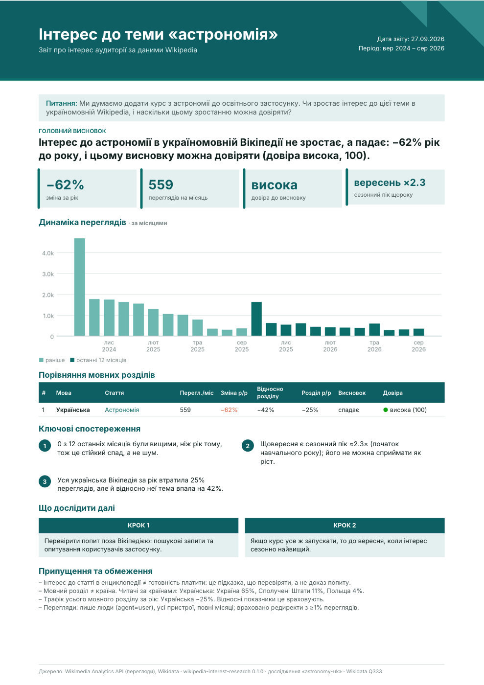
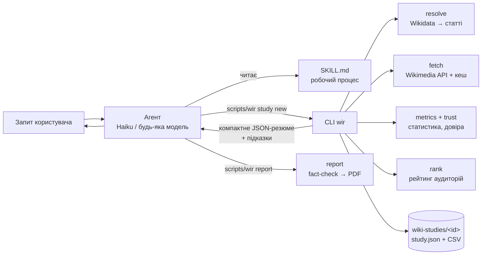

# wikipedia-interest-research

**Навичка ([Agent Skills](https://agentskills.io/specification)) для AI-агента.** Вона допомагає засновникам B2C-продуктів вирішити, **яку тему розвивати далі та якою мовою запускатися**, за даними переглядів Wikipedia. Навичка:
- показує, чи зростає інтерес до теми в різних мовних розділах;
- оцінює, **наскільки цьому тренду можна довіряти** (сезонність, новинні сплески, боти, зміни трафіку всієї Вікіпедії);
- ранжує аудиторії;
- готує **звіт на одну сторінку (PDF)**, яким можна поділитися.

> «Ми думаємо додати курс з астрономії. Чи зростає інтерес в україномовній Wikipedia і наскільки цьому можна довіряти?»
>
> **Ні, інтерес падає: −62% рік до року, довіра висока.** 0 з 12 останніх місяців вищі, ніж рік тому. Вересневий пік ≈2.3× — це початок навчального року, а не ріст. Уся українська Вікіпедія втратила 25% переглядів, але тема падає й відносно неї (−42%). → [PDF-звіт](examples/2-astronomy-uk/report.pdf)

<p align="center"></p>

## Результати

Бенчмарк на **Claude Haiku 4.5**: 14 сценаріїв × 3 прогони, LLM-суддя, [повний звіт](evals/results/benchmark/README.md).

| | Без навички | З навичкою |
|---|---|---|
| 3 приклади із завдання, автоматичні перевірки | 31% | **100%** |
| Оцінка LLM-судді (1–5) | 1.7 | **4.1** |
| Кроків агента (медіана) | 13 | **2** |
| Вартість, $ (медіана) | 0.27 | **0.04** |
| Усі 14 сценаріїв | — | **97%** |
| Правильне ввімкнення навички, 20 запитів, серед 50+ інших навичок | — | **20/20** |

Навичка працює й на безкоштовних моделях OpenRouter через [власний агент](dev/harness/agent.py) ([Крок 8](evals/results/step8/README.md)), не лише в Claude.

## Що вміє

- **Порівнювати мови й теми:** «PL проти CS», «фотографія чи програмування для україномовної аудиторії», кластери понять.
- **Знаходити правильну статтю в кожній мові** через Wikidata. Навичка чесно каже, коли статті немає: у польській Вікіпедії, наприклад, немає статті про інтервальне голодування. Неоднозначні теми («Меркурій») уточнює в користувача.
- **Відрізняти справжній тренд від шуму:**
  - сезонність відокремлює сезонний тест Манна–Кендалла;
  - одноразові події (конклав 2025) очищаються з ряду;
  - ботоподібні сплески розпізнаються;
  - кожен висновок звіряється з трафіком усього мовного розділу.
- **Оцінювати довіру** High / Medium / Low прозорими правилами з поясненням кожної причини.
- **Пам'ятати дослідження:** «додай словацьку» чи «візьми 3 роки» дочитує лише нові дані, а нова сесія продовжує з того самого місця.
- **Робити PDF на 1 сторінку, `summary.md`, графіки й CSV.** Кожне число в тексті агента перевіряється проти даних (fact-check), вигадане число блокує звіт.
- **Попереджати про пастки:**
  - мовний розділ ≠ країна;
  - Wikimedia приховує читачів з 38 країн, зокрема з Туреччини, В'єтнаму й Росії;
  - інтерес ≠ готовність платити.

## Швидкий старт

Потрібен лише [uv](https://docs.astral.sh/uv/): він сам встановить закріплену версію Python і залежності з `uv.lock`.

```bash
brew install uv            # або: curl -LsSf https://astral.sh/uv/install.sh | sh
git clone https://github.com/mytrichq/wikipedia-interest-research.git
cd wikipedia-interest-research
scripts/wir doctor         # перевірити середовище й доступ до API
```

**Підключити до Claude Code**: для всіх проєктів або для одного.

```bash
ln -s "$PWD" ~/.claude/skills/wikipedia-interest-research            # глобально
ln -s "$PWD" /path/to/project/.claude/skills/wikipedia-interest-research
```

Далі просто питай агента, наприклад:
- «Порівняй зростання інтересу до інтервального голодування в польськомовній та чеськомовній Wikipedia за останні два роки».
- «Ми створюємо застосунок для вивчення мов. Порівняй інтерес до вивчення англійської в українській, польській, турецькій, в'єтнамській і португальській Wikipedia та підготуй короткий звіт».

**Інші агенти.** Навичка відповідає специфікації, тож її можна підключити до будь-якого агента з підтримкою Agent Skills. Приклад мінімальної інтеграції є в [`dev/harness/agent.py`](dev/harness/agent.py).

**Без агента.** CLI можна запускати напряму:

```bash
scripts/wir study new --topic astronomy --langs uk,pl --question "Чи росте інтерес до астрономії?"
scripts/wir study update astronomy-uk-pl --add-lang sk
scripts/wir report astronomy-uk-pl --lang uk      # PDF → ./wiki-studies/astronomy-uk-pl/report.pdf
```

## Приклади із завдання

| Запит | Висновок | Звіт |
|---|---|---|
| Інтервальне голодування, PL проти CS | У чеській спад −48,7% (довіра висока); **у польській статті немає** | [PDF](examples/1-intermittent-fasting-pl-cs/report.pdf) · [md](examples/1-intermittent-fasting-pl-cs/summary.md) |
| Курс астрономії, UK + довіра | Спад −62%, довіра висока; вересень — сезонність, а не ріст | [PDF](examples/2-astronomy-uk/report.pdf) · [md](examples/2-astronomy-uk/summary.md) |
| Вивчення англійської, 5 мов + звіт | Спад усюди, але у vi/tr/pl частка теми стабільна; перевіряти першою в'єтнамську | [PDF](examples/3-english-learning/report.pdf) · [md](examples/3-english-learning/summary.md) |

## Як це працює



Принцип розподілу роботи: **агент відповідає за зміст запиту** (яке поняття, які мови, як пояснити), **код за все, що має бути точним:**
- дані, статистика й довіра;
- перевірка чисел;
- формат звіту.

Детально в [docs/DESIGN.md](docs/DESIGN.md).

## Структура репозиторію

Корінь репозиторію і є текою навички: так виконуються і специфікація (`name` = назва теки), і вимога тримати весь код у ній. Агент бачить лише те, на що посилається `SKILL.md`.

```
SKILL.md              інструкції для агента (EN)
scripts/wir           точка входу CLI (uv, закріплене середовище)
src/wir/              код: API, кеш, статистика, довіра, дослідження, звіт, fact-check
references/           довідники, які агент читає на вимогу (методологія, API, інтерпретація, помилки)
assets/               шаблон тексту звіту
tests/                143 тести (офлайн, на записаних відповідях API)
evals/                сценарії, раннери, LLM-суддя, результати бенчмарку
dev/                  міні-агент для OpenRouter, скрипти перевірки й генерації даних
docs/                 архітектура, тест-план, перевірка результатів, roadmap, використання AI
examples/             три звіти для прикладів із завдання
```

## Документація

| Документ | Що в ньому |
|---|---|
| [SKILL.md](SKILL.md) | Робочий процес агента |
| [references/METHODOLOGY.md](references/METHODOLOGY.md) | Формули росту, сезонності, сплесків, правила довіри |
| [docs/DESIGN.md](docs/DESIGN.md) | Архітектура, ключові рішення та компроміси |
| [docs/TEST_PLAN.md](docs/TEST_PLAN.md) | План тестування агента |
| [docs/VERIFICATION.md](docs/VERIFICATION.md) | Як перевірено дані, статистику й звіти |
| [evals/results/](evals/results/) | Baseline, ручні прогони Haiku, free-моделі, бенчмарк |
| [docs/ROADMAP.md](docs/ROADMAP.md) | Як розвивати навичку для складніших досліджень і більших даних |
| [docs/AI_USAGE.md](docs/AI_USAGE.md) | Як використовувався AI і як перевірявся його результат |

## Розробка

```bash
uv sync                                   # середовище з uv.lock
uv run pytest                             # 143 тести без мережі
uv run pytest -m live                     # звірка з живим API
uv run --with scipy python dev/verify_stats.py   # статистика проти SciPy
cd evals && uv run python run.py --help   # бенчмарк агентів
```

CI (GitHub Actions) запускає лінт, тести й офіційний валідатор навичок `skills-ref`.

## Обмеження

- **Інтерес до статті ≠ попит.** Навичка підказує, що перевіряти далі, а не приймає рішення.
- **Мовний розділ ≠ країна**, а частина країн прихована Wikimedia.
- Одна стаття — лише проксі теми, а загальний трафік Вікіпедії падає в багатьох мовах.
- **Мовна якість відповіді залежить від моделі:** у Haiku трапляються русизми, у слабших моделей більше.
- PDF-шрифти покривають латиницю, кирилицю, грецьку й в'єтнамську. Для CJK та арабської використовуйте `summary.md`.

## Ліцензії та джерела

- **Код:** MIT.
- **Дані:** [Wikimedia Analytics API](https://doc.wikimedia.org/generated-data-platform/aqs/analytics-api/) і [Wikidata](https://www.wikidata.org) (CC0).
- **Шрифт:** [Inter](https://github.com/rsms/inter) (SIL OFL 1.1, `src/wir/data/fonts/`).
- **Назви мов і країн:** [Unicode CLDR](https://cldr.unicode.org).
- **Список прихованих країн:** [Wikimedia Country and Territory Protection List](https://foundation.wikimedia.org/wiki/Legal:Wikimedia_Foundation_Country_and_Territory_Protection_List).
