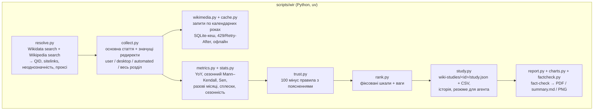

# Архітектура та рішення

## 1. Задача і головне обмеження

**Задача.** Засновник питає: «куди інвестувати: яку тему, якою мовою?». Навичка має дати відповідь на даних Wikipedia, чесно оцінити надійність, запам'ятати контекст для уточнень і видати звіт, яким можна поділитися.

**Головне обмеження: навичка має добре працювати на дешевій моделі** (Haiku 4.5, безкоштовні моделі OpenRouter). Звідси всі ключові рішення: маленька модель погано рахує, легко вигадує числа й неуважно читає довгі інструкції. Тому все, що має бути точним, робить **код**, а модель відповідає за **зміст і мову**.

## 2. Поділ відповідальності

| Відповідає агент (LLM) | Відповідає код (`scripts/wir`) |
|---|---|
| Зрозуміти запит: тема, мови, період, що важливо | Знайти поняття у Wikidata й статтю в кожній мові |
| Перекласти тему в англійську назву поняття | Завантажити перегляди з повагою до API: User-Agent, повтори, кеш |
| Вирішити, чи уточнити в користувача | Очистити дані: неповні місяці, дні без переглядів, редиректи, боти |
| Пояснити результат мовою користувача | Порахувати ріст, значущість, сезонність, сплески й відносну зміну |
| Сформулювати рекомендацію «що перевірити далі» | Оцінити довіру з причинами; побудувати рейтинг |
| | Зберегти дослідження й історію припущень |
| | **Перевірити кожне число** в тексті агента; зібрати PDF на 1 сторінку |

## 3. Потік даних

| Модуль | Роль |
|---|---|
| `wikimedia.py`, `cache.py` | Клієнт Analytics / Action / Wikidata API: кеш, повтори, офлайн |
| `resolve.py`, `languages.py` | Тема → поняття → статті; мовні розділи, назви, приховані країни |
| `periods.py`, `series.py`, `collect.py` | Періоди з повних місяців; ряди, редиректи, вікно аналізу |
| `stats.py`, `metrics.py` | Статистика (власна реалізація, звірена зі SciPy) і метрики |
| `trust.py`, `rank.py` | Індекс довіри і рейтинг |
| `study.py` | Дослідження як пам'ять; компактне резюме для агента |
| `report.py`, `charts.py`, `factcheck.py` | Звіт, графіки, перевірка чисел |
| `cli.py` | Команди, JSON-вивід, коди виходу |

## 4. Ключові рішення

### 4.1. Корінь репозиторію = тека навички

Специфікація вимагає, щоб `name` збігався з назвою теки, а завдання — щоб увесь код був у теці навички. Рішення «репо = навичка» виконує обидві вимоги буквально.

Щоб агент не блукав службовими файлами:
- `SKILL.md` посилається лише на `scripts/`, `references/` і `assets/`;
- для evals агент отримує **пакет навички** без `tests/`, `evals/`, `docs/`.

Це рішення знадобилося після того, як перший baseline виявився забрудненим: агент прочитав очікувані відповіді з `evals/cases.yaml`.

### 4.2. Python + uv, одна точка входу

- **Чому Python:** pandas і numpy для рядів, matplotlib для графіків, reportlab для PDF. Усі пакети встановлюються з wheel-файлів, системних залежностей немає.
- **Чому uv:** `uv.lock` і `.python-version` фіксують середовище, а uv сам ставить потрібний Python.
- **Точка входу:** `scripts/wir` запускає CLI у закріпленому середовищі з будь-якої теки; якщо uv немає, пише, як його встановити.
- **Без скомпільованих файлів:** жодних бінарників у репо, лише код і дані.

### 4.3. Одна команда на весь конвеєр і компактний вивід

`study new` виконує все: пошук поняття, завантаження, аналіз, довіру, рейтинг і збереження. Агент робить **2 виклики інструментів** замість десятків.

Вивід — компактне JSON-резюме (≈700 символів на мову), де є лише ті числа, які агенту можна цитувати. Сирі дані лежать у файлах, а не в контексті моделі.

### 4.4. Підказки у виводі, а не лише в `SKILL.md`

Найважливіший урок ручних прогонів (Крок 7): **маленька модель уважніше читає вивід інструмента, ніж `SKILL.md`.** Правила з розділу Gotchas Haiku ігнорувала приблизно через раз. Та сама підказка у JSON, який модель читає в момент відповіді, спрацьовувала стабільно. Тому у виводі CLI є:

| Поле | Що підказує |
|---|---|
| `next_steps` | «Користувач просив звіт, зроби його зараз» |
| `note` | Пояснення словами, чому «сирий» і очищений ріст різняться |
| `relative_note` | «±10% відносно розділу — це стабільно, не ріст» |
| `readers_by_country` | Для прихованих країн: `MISLEADING WITHOUT CAVEAT`, розмір аудиторії невідомий |
| `limitations_for_chat` | Готові обмеження мовою звіту |
| `changes_since_previous_state` | Що змінилося після `study update` |

### 4.5. Поняття Wikidata, а не рядок пошуку

Тема перетворюється на QID, а назви статей беруться з sitelinks.

- **Відсутня стаття — це явний статус `missing`.** Навичка ніколи не вгадує назву. Проксі-стаття можлива, але лише явно, з позначкою PROXY і штрафом до довіри.
- **Неоднозначність** («Меркурій») визначається, коли є кілька точних збігів з порівнянною популярністю (≥30% мовних розділів лідера). Твори, названі на честь поняття (фільм «Conclave»), неоднозначності не створюють.
- **Точна назва може вказати не на те поняття.** «Learning English» дає програму VOA. Тому вивід показує `matched_by` та альтернативи, а агент звіряє опис поняття із запитом.

### 4.6. Статистика: стійкість важливіша за точність

- **Ріст:** медіана відношень «місяць до того ж місяця рік тому». Один аномальний місяць її не зсуває.
- **Значущість:** сезонний тест Манна–Кендалла (Hirsch). Кожен місяць порівнюється лише з тим самим місяцем, тож вересневий шкільний пік не зараховується як ріст. Результат зрозумілий людям: «0 з 12 місяців вищі».
- **Разові місяці:** місяць ≥2.5× типового, коли той самий місяць в інші роки нормальний. Це ловить новинні події тривалістю в кілька тижнів, які пропускає ковзна медіана.
- **Власна реалізація на numpy замість SciPy/statsmodels.** Це ~80 рядків замість залежностей на десятки мегабайт. Код звірено зі SciPy на 500 випадкових рядах, розбіжність нульова. Звірка знайшла одну помилку в довірчому інтервалі.

### 4.7. Довіра: прозорі правила замість «чорної скриньки»

Оцінка стартує зі 100 балів, і кожне правило знімає фіксовану кількість з поясненням людською мовою. Приклади правил:
- `low_volume` −65;
- `spike_driven` −30;
- `edition_effect` −35 (абсолютна й відносна зміна розходяться);
- `proxy_article` −30.

Чому правила, а не модель машинного навчання: розмітки для навчання немає, а засновнику важливо розуміти, **чому** висновку не варто довіряти. Правила перевірено на синтетичних рядах із відомою відповіддю та на 11 реальних статтях. Реальні дані змусили переробити 3 правила.

### 4.8. Нормалізація на весь мовний розділ

- **Навіщо:** уся українська Вікіпедія втратила 25% переглядів за рік (AI-відповіді в пошуку, зміни трафіку). Без поправки на це майже будь-яка тема «падає».
- **Як:** кожен висновок звіряється з часткою теми на мільйон переглядів розділу. Якщо абсолютна й відносна зміна розходяться, довіра знижується.

### 4.9. Пам'ять: файли дослідження і кеш

- **Дослідження:** `wiki-studies/<id>/study.json` зберігає специфікацію, результати, припущення й історію змін. Уточнення (`study update`) перераховуються з кешу. Файли не залежать від агента чи моделі, тож нова сесія або інша модель продовжує через `study show`.
- **Кеш:** SQLite, ключ — URL. Запити розбиваються на **календарні роки**, і завершені роки зберігаються назавжди, тож зміна періоду дочитує лише нові роки.
- **Де зберігаються дослідження:** у проєкті користувача, навіть коли агент зробив `cd` у теку навички. Haiku робила це в 3 з 4 прогонів, тому це вирішено в коді.

### 4.10. Звіт і fact-check

- **PDF:** reportlab + matplotlib, шрифт Inter. Якщо не влазить, масштаб зменшується крок за кроком до однієї сторінки A4. Мова звіту (uk/en) визначається мовою тексту агента.
- **Fact-check:** кожне число в тексті агента має бути серед чисел, які агент бачив, з урахуванням округлення. Інакше звіт не будується, а помилка називає найближчі правильні значення.

  Перша версія пропускала будь-що, бо звіряла з усіма службовими числами в `study.json`. Тепер вона ловить вигадані числа, що перевірено тестами з навмисними підмінами.

### 4.11. Приховані країни

Wikimedia не публікує географію читачів для 38 країн зі свого списку захисту (Росія, Туреччина, В'єтнам, Іран, Китай…). Без цього знання навичка сказала б «турецьку Вікіпедію читають переважно в США (31%)». Вбудовано офіційний список 2026 року та прив'язку мов до країн: для таких мов вивід прямо попереджає.

### 4.12. Ввічливість до API і безпека

- **Wikimedia:** описовий User-Agent з контактом, послідовні запити, повага до `Retry-After`, агресивний кеш.
- **Секрети:** ключ OpenRouter зберігається лише в `.env` (в `.gitignore`). Міні-агент прибирає секрети з оточення команд моделі й відхиляє руйнівні команди.
- **CI:** зовнішній валідатор закріплено на конкретному коміті.

## 5. Тестування та оцінка

Докладно в [TEST_PLAN.md](TEST_PLAN.md).

- **Код:** 143 тести на записаних відповідях API (стиснуті касети, 0.3 МБ) і синтетичних рядах з відомою відповіддю.
- **Агенти:** 3 середовища.
  - `baseline`: без навички;
  - `clean`: лише наша навичка;
  - `realistic`: 50+ навичок користувача.
  - Кожен прогін іде в ізольованій тимчасовій теці з пакетом навички.
- **Оцінювання:** детерміновані перевірки ([`evals/checks.py`](../evals/checks.py)) і LLM-суддя за рубрикою ([`evals/judge.py`](../evals/judge.py)).

## 6. Компроміси, які свідомо прийнято

| Рішення | Чим заплатили | Чому варте того |
|---|---|---|
| Мінімум 24 місяці для статистики | Для запиту «за останній рік» тягнемо ще рік історії | Без порівняння рік до року сезонність не відокремити |
| Суворий критерій значущості (p<0,05 сезонного тесту) | На 2 роках даних «росте» вимагає ~10 з 12 місяців | Засновнику шкідливіше хибне «росте», ніж обережне «неоднозначно» |
| Фіксовані шкали рейтингу | Оцінки не розтягуються на весь діапазон 0–100 | Додавання мови не змінює оцінок інших мов, тож уточнення стабільні |
| Послідовні запити до API | Холодний старт на 5 мов триває ~10 с | Ввічливість до Wikimedia; повторні запити йдуть з кешу |
| Власна статистика замість SciPy | Потрібна власна перевірка | Навичка легша на десятки МБ; перевірено скриптом `dev/verify_stats.py` |
| Fact-check лише для чисел | Слова «висока/середня» не перевіряються | Числа — найчастіша й найшкідливіша галюцинація; рівні довіри в roadmap |
