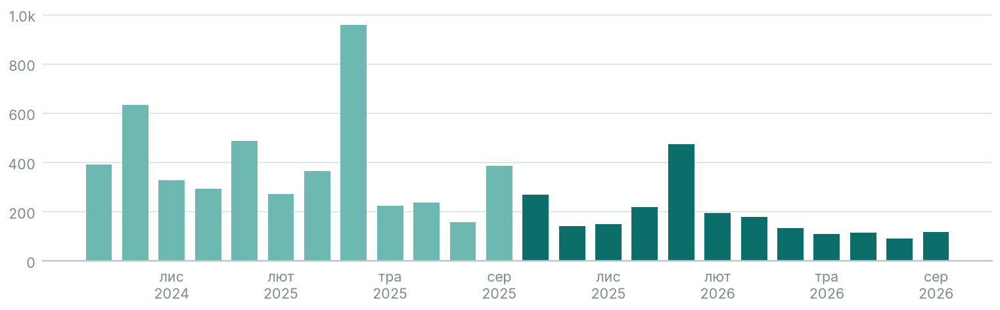

# Інтерес до теми «Інтервальне голодування»

> Порівняй зростання інтересу до інтервального голодування в польськомовній та чеськомовній Wikipedia за останні два роки.

**У чеськомовній Вікіпедії інтерес до інтервального голодування падає (−48,7% за рік, довіра висока), а в польськомовній окремої статті на цю тему немає.**

| # | Мова | Стаття | Перегл./міс | Зміна р/р | Відносно розділу | Розділ р/р | Висновок | Довіра |
|---|---|---|---|---|---|---|---|---|
| 1 | Чеська | [Přerušovaný půst](https://cs.wikipedia.org/wiki/Přerušovaný_půst) | 183 | −49% | −30% | −13% | спадає | висока (80) |
| — | Польська | немає статті | | | | | | |

## Ключові спостереження
1. Чеськомовна: 0 з 12 останніх місяців вищі, ніж рік тому; близько 183 переглядів на місяць.
2. Щороку є січневий пік ≈2,17× (імовірно, новорічні плани) — це сезонність, а не ріст.
3. Уся чеськомовна Вікіпедія за рік втратила 12,6% переглядів, але тема впала й відносно неї: −30,5%.
4. Польськомовна: статті немає — це прогалина в контенті, а не нульовий інтерес; напряму порівняти ріст неможливо.

## Що дослідити далі
- Перевірити попит у Польщі поза Вікіпедією: пошукові запити «post przerywany», застосунки в магазинах.
- Для грубого сигналу можна додати проксі-статтю «Głodówka lecznicza» з позначкою, що це ширше поняття.

## Припущення та обмеження
- Інтерес до статті в енциклопедії ≠ готовність платити: це підказка, що перевіряти, а не доказ попиту.
- Мовний розділ ≠ країна. Читачі за країнами: Польська: Польща 87%, Сполучені Штати 4%, Німеччина 2%; Чеська: Чехія 80%, Сполучені Штати 5%, Словаччина 5%.
- Трафік усього мовного розділу за рік: Чеська −13%. Відносні показники це враховують.
- Польська: статті на цю тему немає.
- Перегляди: лише люди (agent=user), усі пристрої, повні місяці; враховано редиректи з ≥1% переглядів.

_Джерело: Wikimedia Analytics API (перегляди), Wikidata · wikipedia-interest-research 0.1.0 · дослідження «fasting-pl-cs»_
