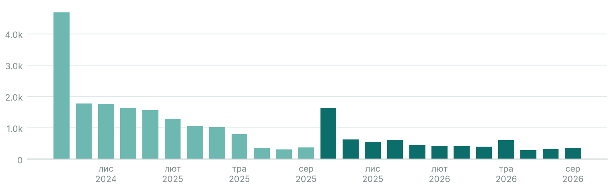

# Інтерес до теми «астрономія»

> Ми думаємо додати курс з астрономії до освітнього застосунку. Чи зростає інтерес до цієї теми в україномовній Wikipedia, і наскільки цьому зростанню можна довіряти?

**Інтерес до астрономії в україномовній Вікіпедії не зростає, а падає: −62% рік до року, і цьому висновку можна довіряти (довіра висока, 100).**

| # | Мова | Стаття | Перегл./міс | Зміна р/р | Відносно розділу | Розділ р/р | Висновок | Довіра |
|---|---|---|---|---|---|---|---|---|
| 1 | Українська | [Астрономія](https://uk.wikipedia.org/wiki/Астрономія) | 559 | −62% | −42% | −25% | спадає | висока (100) |

## Ключові спостереження
1. 0 з 12 останніх місяців були вищими, ніж рік тому, тож це стійкий спад, а не шум.
2. Щовересня є сезонний пік ≈2.3× (початок навчального року); його не можна сприймати як ріст.
3. Уся українська Вікіпедія за рік втратила 25% переглядів, але й відносно неї тема впала на 42%.

## Що дослідити далі
- Перевірити попит поза Вікіпедією: пошукові запити та опитування користувачів застосунку.
- Якщо курс усе ж запускати, то до вересня, коли інтерес сезонно найвищий.

## Припущення та обмеження
- Інтерес до статті в енциклопедії ≠ готовність платити: це підказка, що перевіряти, а не доказ попиту.
- Мовний розділ ≠ країна. Читачі за країнами: Українська: Україна 65%, Сполучені Штати 11%, Польща 4%.
- Трафік усього мовного розділу за рік: Українська −25%. Відносні показники це враховують.
- Перегляди: лише люди (agent=user), усі пристрої, повні місяці; враховано редиректи з ≥1% переглядів.

_Джерело: Wikimedia Analytics API (перегляди), Wikidata · wikipedia-interest-research 0.1.0 · дослідження «astronomy-uk»_
