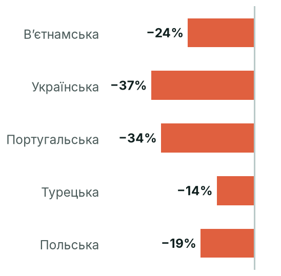
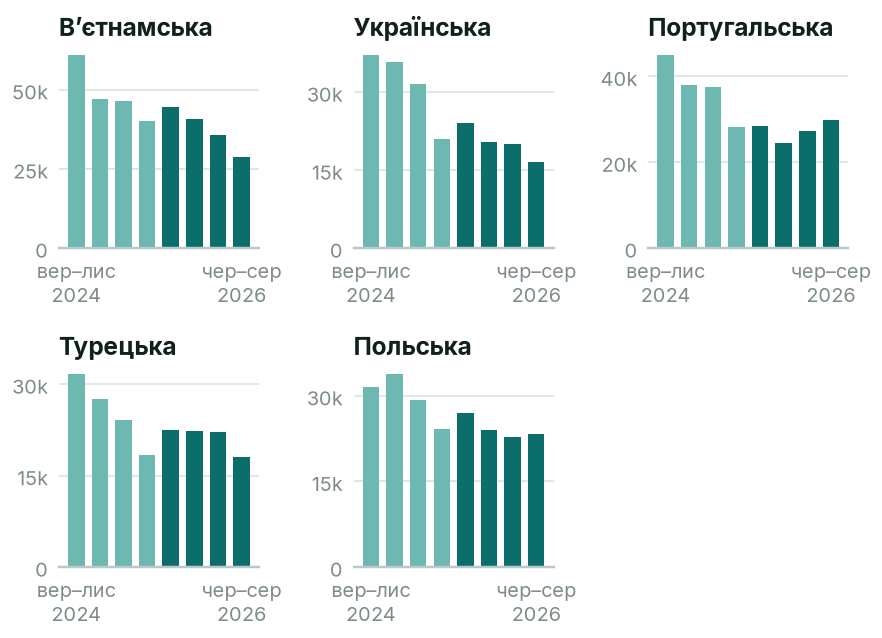

# Інтерес до теми «англійська мова»

> Ми створюємо застосунок для вивчення мов. Порівняй інтерес до вивчення англійської у вибраних нами мовних розділах (українська, польська, турецька, в'єтнамська, португальська) та підготуй короткий звіт: які аудиторії варто дослідити наступними й чому?

**Інтерес до статті про англійську мову знижується в усіх 5 розділах; першою варто перевірити в'єтнамськомовну аудиторію (№1 у рейтингу), далі українську.**

| # | Мова | Стаття | Перегл./міс | Зміна р/р | Відносно розділу | Розділ р/р | Висновок | Довіра |
|---|---|---|---|---|---|---|---|---|
| 1 | Вʼєтнамська | [Tiếng Anh](https://vi.wikipedia.org/wiki/Tiếng_Anh) | 12 478 | −24% | +3% | −24% | спадає | середня (65) |
| 2 | Українська | [Англійська мова](https://uk.wikipedia.org/wiki/Англійська_мова) | 6 730 | −37% | −10% | −25% | спадає | висока (100) |
| 3 | Португальська | [Língua inglesa](https://pt.wikipedia.org/wiki/Língua_inglesa) | 9 178 | −34% | −12% | −17% | спадає | висока (100) |
| 4 | Турецька | [İngilizce](https://tr.wikipedia.org/wiki/İngilizce) | 7 080 | −14% | +5% | −16% | спадає | середня (65) |
| 5 | Польська | [Język angielski](https://pl.wikipedia.org/wiki/Język_angielski) | 8 087 | −19% | −10% | −9% | спадає | середня (65) |

## Ключові спостереження
1. В'єтнамська: найбільший обсяг (12 478 переглядів/міс, 255 на мільйон), −24% за рік, але відносно всієї в'єтнамської Вікіпедії стабільно (+2,9%); довіра середня.
2. Українська: −37,3% за рік і −10,5% відносно розділу, 0 з 12 місяців вище; довіра висока, тож спад реальний.
3. Турецька й польська відносно своїх розділів стабільні (+5,3% і −9,9%); довіра середня.
4. Португальська: −33,7% за рік, довіра висока; 74% читачів із Бразилії, тож це передусім бразильський ринок.

## Що дослідити далі
- В'єтнамська: перевірити попит поза Вікіпедією (пошук, магазини застосунків); читачів із В'єтнаму Wikimedia приховує, тож розмір аудиторії невідомий.
- Українська: з'ясувати опитуванням, чи спад стосується саме вивчення англійської — дані тут надійні.
- Турецька: оцінити конкуренцію та пошуковий попит, бо частка теми в розділі стабільна.

## Припущення та обмеження
- Інтерес до статті в енциклопедії ≠ готовність платити: це підказка, що перевіряти, а не доказ попиту.
- Мовний розділ ≠ країна. Читачі за країнами: Українська: Україна 65%, Сполучені Штати 11%, Польща 4%; Польська: Польща 87%, Сполучені Штати 4%, Німеччина 2%; Португальська: Бразилія 74%, Португалія 9%, Сполучені Штати 9%.
- Турецька: Wikimedia приховує читачів з Туреччина (список захисту приватності), тож розподіл за країнами неповний.
- Вʼєтнамська: Wikimedia приховує читачів з Вʼєтнам (список захисту приватності), тож розподіл за країнами неповний.
- Трафік усього мовного розділу за рік: Українська −25%, Польська −9%, Турецька −16%, Вʼєтнамська −24%, Португальська −17%. Відносні показники це враховують.
- Перегляди: лише люди (agent=user), усі пристрої, повні місяці; враховано редиректи з ≥1% переглядів.

_Джерело: Wikimedia Analytics API (перегляди), Wikidata · wikipedia-interest-research 0.1.0 · дослідження «english-learning»_
